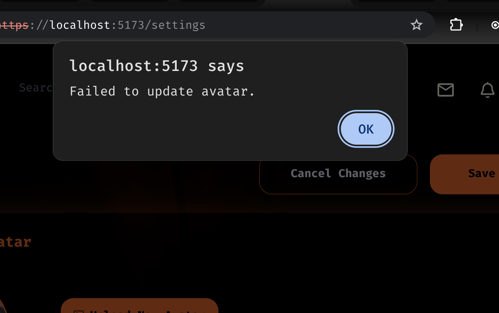

# ft_transcendence Task Board

## DevOps & Security (Me)

- [x] Fix ModSecurity config loading order (Solved).
- [ ] Add "Double Extension" rule to WAF (Block `image.php.jpg`).
- [x] Update `scan_php.sh` to block non-image Magic Bytes (PDFs/EXEs).
- [ ] Set up Rate Limiting in Nginx/ModSec to stop spam uploads.
- [x] Ensure Prometheus & Grafana are scraping backend metrics.
- [ ] Add false positive rules for searchbar and password.
- [ ] GRPC

## Frontend (MMONDAD)

- [ ] **JWT Not Updated:** When I log out and get back, the containers are EXITED, I refresh the page I get the
      sign in form, I do sign in the backend generates a new token, but the jwt token is not updated in
      local storage, so even if i am logged in i cant upload any image because i need the up to date jwt token.
      

- [ ] **Uploads:** Add `accept="image/png, image/jpeg"` to the file input HTML.
- [ ] **Error Handling:** Display generic error messages from backend (example: "Upload failed").
- [ ] **UX:** When I finish uploading an avatar, I should get out from the settings page.
		PS. (hes-safi) I don't agree with this! You should stay in Settings.
- [ ] **Offline Session:** Add session storage info for offline PvP & PvAI (Look for file sessionStorage.ts in Front).

## Backend (OHAMMOU-)

- [ ] **Global Error Handler:** Stop returning 502s. Catch errors and return JSON `{ "message": "..." }
- [x] **Create a vertial tables using view:**
- [x] **Create indexes to facilitate the sort users based on scor**
- [x] **add  leader Bord route**
- [x] **Validation:** Use `file-type` library to check Magic Bytes before saving (Safety Net).
- [ ] **Logs:** Ensure errors are printed as JSON for the ELK stack.
- [x] **Use node modules:** Import instead of  require.
- [ ] **learn gRPC:** to build mecro sirveces

## Game (HES-SAFI)

- [ ] **Prod .JS Filename:** Need to change the randomly generated name with 'pong.js'. VITE Bundler knowledge.

## Known Bugs

- [ ]
