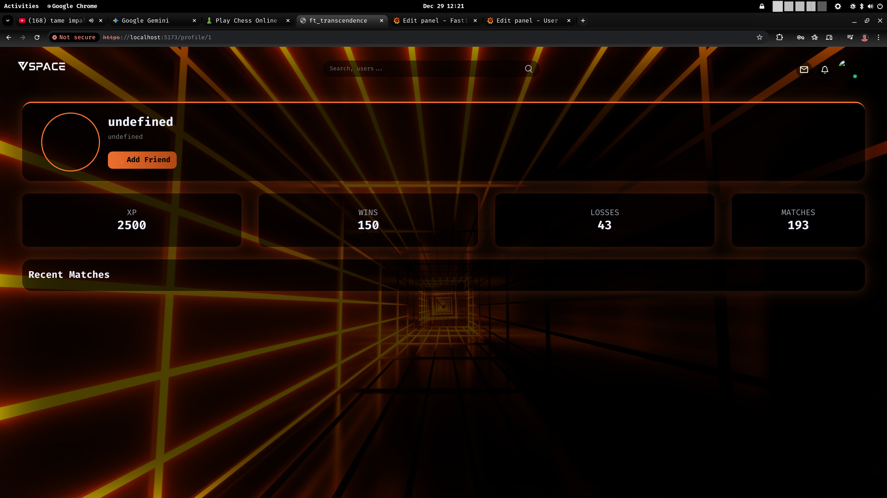

# ft_transcendence Task Board

## DevOps & Security (Me)

- [x] Fix ModSecurity config loading order (Solved).
- [x] Add "Double Extension" rule to WAF (Block `image.php.jpg`).
- [x] Update `scan_php.sh` to block non-image Magic Bytes (PDFs/EXEs).
- [ ] Set up Rate Limiting in Nginx/ModSec to stop spam uploads.
- [x] Ensure Prometheus & Grafana are scraping backend metrics.
- [ ] Add false positive rules for searchbar and password.(half done)
- [x] Microservices are done(logs and using createError() also the global err handling and bubbling is all set)
- [x] Added /metrics and counting logging attempts and all other events.... optimized the whole backend code

## Frontend (MMONDAD)

- the window inactive jwt expired if i refresh the page i should get that session expired login again

- [ ] **JWT Not Updated:** When I log out and get back, the containers are EXITED, I refresh the page I get the
      sign in form, I do sign in the backend generates a new token, but the jwt token is not updated in
      local storage, so even if i am logged in i cant upload any image because i need the up to date jwt token.
      

- [ ] **Uploads:** Add `accept="image/png, image/jpeg"` to the file input HTML.
- [ ] **Error Handling:** Display generic error messages from backend (example: "Upload failed").
- [ ] **UX:** When I finish uploading an avatar, I should get out from the settings page.
  PS. (hes-safi) I don't agree with this! You should stay in Settings.
- [ ] **Offline Session:** Add session storage info for offline PvP & PvAI (Look for file sessionStorage.ts in Front).

## Backend (OHAMMOU-)

- [x] **Global Error Handler:** Stop returning 502s. Catch errors and return JSON `{ "message": "..." }
- [x] **Create a vertial tables using view:**
- [x] **Create indexes to facilitate the sort users based on scor**
- [x] **add  leader Bord route**
- [x] **Validation:** Use `file-type` library to check Magic Bytes before saving (Safety Net).
- [x] **Logs:** Ensure errors are printed as JSON for the ELK stack.
- [x] **Use node modules:** Import instead of  require.
- [canceled] **learn gRPC:** to build mecro sirveces
- [ ] **send the email to the front:**
- [x] **setup the app chat service**
- [x] **create a chat databases:** cash database to store the user information and message database to store the last messages
- [x] **open the sockets and start users commencation:** send messages with users
- [x] **store the messages in database**
- [x] **get the data from the user services and store it in the cash while send it to the front:**
- [ ] **get the data from users using amqp protocole and RabbitMQ brocker**
- [ ] **send the state of user online/offline**
- [ ] **is_read re structur**
- [ ] **send the prives messages to the front**
<!-- union intersect distinct  -->
- [ ] **learn gRPC:** to build mecro sirveces

## Game (HES-SAFI)

- [ ] **Prod .JS Filename:** Need to change the randomly generated name with 'pong.js'. VITE Bundler knowledge.

## Known Bugs

- [ ]

"npx depcheck" ==> checks unused packages in package.json

this what happens when i refresh the page, (mse7t database w restartit server):
(simo: tatrj3 lik 404 wmatadir walo)
(ohammou: 9ra dok logs w protecti code dialk)

